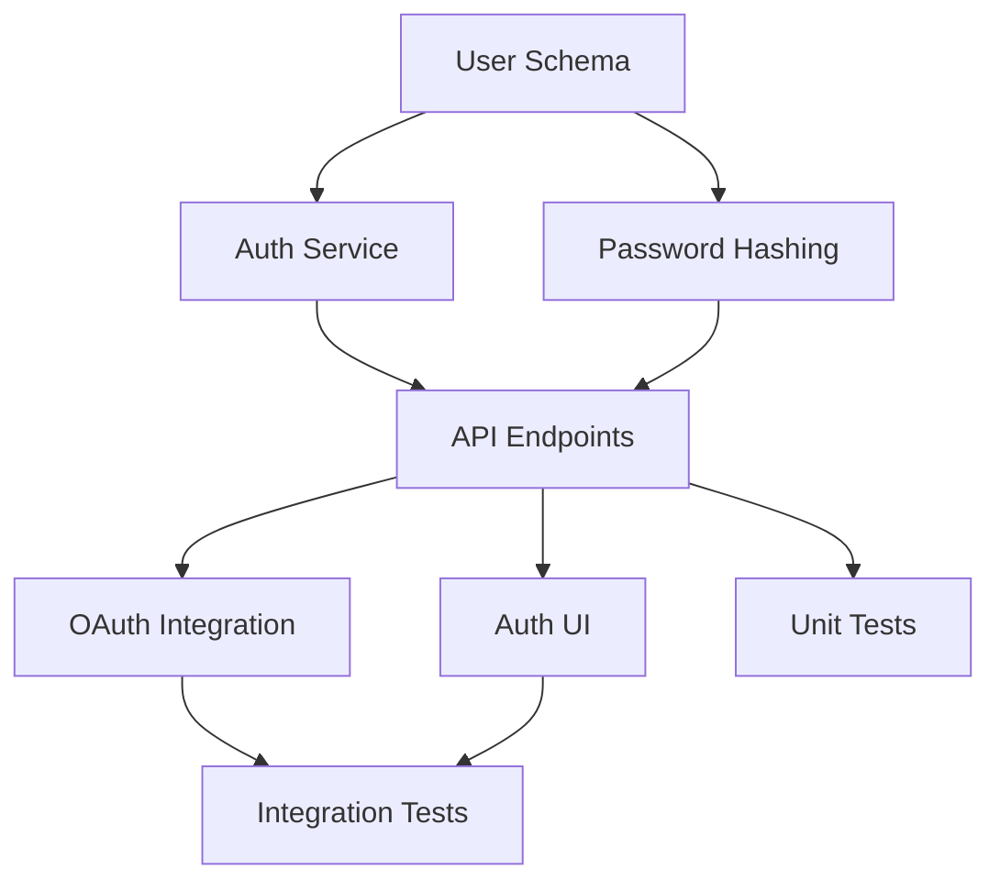

# /swarm-planner - Dependency-Aware Planning

## Purpose
Generates a structured execution plan with dependency tracking using the Swarms-inspired planning methodology.

## Usage

```bash
/swarm-planner "task-description"
/swarm-planner "Build user authentication system"
/swarm-planner "Implement e-commerce checkout flow" --detailed
```

## Options

| Option | Description |
|--------|-------------|
| --detailed | Generate comprehensive plan with risk analysis |
| --waves | Output execution waves for parallel processing |
| --json | Output in JSON format for programmatic use |
| --estimate | Include time/effort estimates |

## Workflow

When invoked, @Planner executes the following sequence:

### 1. Task Analysis
```
Input: "Build user authentication system"

Analysis:
├─ Complexity: HIGH
├─ Components: Database, API, UI, Security
├─ Dependencies: Schema → API → UI
├─ Parallelizable: ~60%
└─ Security-Critical: YES
```

### 2. Decomposition
Break into atomic sub-tasks with clear boundaries:

```yaml
tasks:
  - id: T1
    name: "Create user schema"
    agent: "@DatabaseAgent"
    deps: []
    confidence: 95%

  - id: T2
    name: "Implement auth service"
    agent: "@SecurityAgent"
    deps: [T1]
    confidence: 85%

  - id: T3
    name: "Create API endpoints"
    agent: "@APIAgent"
    deps: [T1, T2]
    confidence: 80%
```

### 3. Dependency Graph
Generate DAG for parallel execution:

```
Wave 1: [T1]           → Foundation (no deps)
Wave 2: [T2, T4]       → Core services (depend on T1)
Wave 3: [T3, T5, T6]   → Implementation (depend on T2)
Wave 4: [T7, T8]       → Testing (depend on T3-T6)
```

### 4. Confidence Routing
Route tasks based on confidence scores:

```
AUTO-PROCEED (≥70%): T1, T2, T3, T4, T6, T7, T8
QUEUE (40-69%):      T5 (OAuth integration - 55%)
BLOCK (<40%):        None
```

## Output

### Default Output (plan.md)

```markdown
# Execution Plan: User Authentication System

## Summary
- Total Tasks: 8
- Execution Waves: 4
- Parallelizable: 65%
- Human Review Required: 1 task (OAuth)

## Dependency Graph



## Execution Waves

### Wave 1: Foundation
| ID | Task | Agent | Confidence |
|----|------|-------|------------|
| T1 | Create user schema | @DatabaseAgent | 95% |

### Wave 2: Core Services
| ID | Task | Agent | Confidence |
|----|------|-------|------------|
| T2 | Auth service | @SecurityAgent | 85% |
| T4 | Password hashing | @SecurityAgent | 90% |

...
```

### JSON Output (--json)

```json
{
  "plan_id": "auth-system-001",
  "goal": "Build user authentication system",
  "created": "2026-01-22T10:00:00Z",
  "tasks": [...],
  "waves": [...],
  "routing": {
    "auto_proceed": ["T1", "T2", "T3"],
    "queue": ["T5"],
    "block": []
  },
  "metrics": {
    "total_tasks": 8,
    "parallelizable_pct": 65,
    "estimated_duration": "2-3 hours"
  }
}
```

## Integration with @chief

After plan generation:

```
@Planner → @chief:

"📋 Plan generated for 'User Authentication System'

8 tasks in 4 waves
7 auto-proceed | 1 queued | 0 blocked

Ready for /parallel-task execution.
Plan saved to: thoughts/shared/plans/plan-auth-001.md"
```

## Files Created

| File | Description |
|------|-------------|
| `thoughts/shared/plans/plan-[id].md` | Human-readable plan |
| `thoughts/shared/plans/plan-[id].json` | Machine-readable plan |
| `thoughts/shared/plans/plan-[id].mermaid` | Dependency graph |

## Best Practices

1. **Be Specific** - Provide detailed task descriptions
2. **Include Context** - Mention existing code, constraints
3. **Review Plans** - Verify before executing with /parallel-task
4. **Iterate** - Refine plans based on @Verifier feedback

## Related Commands

- `/parallel-task` - Execute the generated plan
- `/spawn-subagent` - Manually spawn agents for tasks
- `/team-status` - Monitor execution progress
- `/review-queue` - View queued tasks

---

**Last Updated**: 2026-01-22
**Maintained By**: Legendary Team Agents
