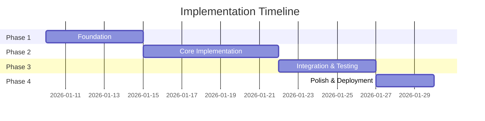

# Implementation Plan - [Feature/Project Name]

**Date**: [YYYY-MM-DD]
**Author**: @[agent-name]
**Status**: 📋 DRAFT | ✅ APPROVED | 🚧 IN PROGRESS | ✅ COMPLETE
**Version**: 1.0

---

## 📋 Executive Summary

[2-3 sentence overview of what this plan accomplishes and why it matters]

**Key Points**:
- [Main point 1]
- [Main point 2]
- [Main point 3]

---

## 🎯 Problem Statement

### Current Situation
[Describe what exists today and why it's insufficient]

### Pain Points
1. **[Pain Point 1]**: [Description and impact]
2. **[Pain Point 2]**: [Description and impact]
3. **[Pain Point 3]**: [Description and impact]

### User Stories
```gherkin
As a [user type]
I want [feature]
So that [benefit]
```

**Additional Stories**:
- As a [user type], I want [feature] so that [benefit]
- As a [user type], I want [feature] so that [benefit]

---

## 🎯 Goals & Objectives

### Primary Goals
1. **[Goal 1]**: [Specific, measurable outcome]
2. **[Goal 2]**: [Specific, measurable outcome]
3. **[Goal 3]**: [Specific, measurable outcome]

### Success Metrics
| Metric | Current | Target | How to Measure |
|--------|---------|--------|----------------|
| [Metric 1] | [Value] | [Value] | [Method] |
| [Metric 2] | [Value] | [Value] | [Method] |
| [Metric 3] | [Value] | [Value] | [Method] |

### Non-Goals
- ❌ [What this plan explicitly does NOT cover]
- ❌ [Out of scope item 2]
- ❌ [Out of scope item 3]

---

## 🏗️ Proposed Solution

### High-Level Approach
[Describe the overall strategy in 2-3 paragraphs]

### Architecture Diagram
```
┌─────────────┐      ┌─────────────┐      ┌─────────────┐
│  Component  │─────▶│  Component  │─────▶│  Component  │
│      A      │      │      B      │      │      C      │
└─────────────┘      └─────────────┘      └─────────────┘
       │                    │                    │
       └────────────────────┴────────────────────┘
                            │
                     ┌──────▼──────┐
                     │   Database  │
                     └─────────────┘
```

### Components

#### Component 1: [Component Name]
**Purpose**: [What this component does]

**Responsibilities**:
- [Responsibility 1]
- [Responsibility 2]
- [Responsibility 3]

**Technology**: [Language/Framework]

**Location**: `path/to/component/`

**Key Files**:
- `file1.ext` - [Purpose]
- `file2.ext` - [Purpose]

**Interfaces**:
```typescript
interface ComponentA {
  method1(param: Type): ReturnType
  method2(param: Type): ReturnType
}
```

#### Component 2: [Component Name]
[Same structure as above]

---

## 🔀 Alternative Approaches Considered

### Alternative 1: [Approach Name]
**Description**: [How this would work]

**Pros**:
- ✅ [Advantage 1]
- ✅ [Advantage 2]

**Cons**:
- ❌ [Disadvantage 1]
- ❌ [Disadvantage 2]

**Why Not Chosen**: [Main reason this was rejected]

### Alternative 2: [Approach Name]
**Description**: [How this would work]

**Pros**:
- ✅ [Advantage 1]

**Cons**:
- ❌ [Disadvantage 1]
- ❌ [Disadvantage 2]

**Why Not Chosen**: [Main reason this was rejected]

---

## 🛠️ Implementation Steps

### Phase 1: Foundation (Week 1)
**Goal**: [What Phase 1 achieves]

#### Step 1.1: [Task Name]
**Description**: [What needs to be done]
**Files**: `path/to/file.ext`
**Estimated Time**: [X hours]
**Dependencies**: None
**Tests Required**: [What to test]

#### Step 1.2: [Task Name]
**Description**: [What needs to be done]
**Files**: `path/to/file.ext`
**Estimated Time**: [X hours]
**Dependencies**: Step 1.1
**Tests Required**: [What to test]

**Phase 1 Success Criteria**:
- [ ] [Criterion 1]
- [ ] [Criterion 2]
- [ ] All tests passing

---

### Phase 2: Core Implementation (Week 2)
**Goal**: [What Phase 2 achieves]

#### Step 2.1: [Task Name]
[Same structure as above]

#### Step 2.2: [Task Name]
[Same structure as above]

**Phase 2 Success Criteria**:
- [ ] [Criterion 1]
- [ ] [Criterion 2]

---

### Phase 3: Integration & Testing (Week 3)
**Goal**: [What Phase 3 achieves]

#### Step 3.1: [Task Name]
[Same structure as above]

**Phase 3 Success Criteria**:
- [ ] [Criterion 1]
- [ ] [Criterion 2]

---

### Phase 4: Polish & Deployment (Week 4)
**Goal**: [What Phase 4 achieves]

#### Step 4.1: [Task Name]
[Same structure as above]

**Phase 4 Success Criteria**:
- [ ] [Criterion 1]
- [ ] Production ready

---

## 🏛️ Architectural Decisions

### Decision 1: [Decision Title]
**Question**: [What needs to be decided]

**Options**:
1. [Option A] - [Description]
2. [Option B] - [Description]
3. [Option C] - [Description]

**Chosen**: [Option B]

**Rationale**:
- [Reason 1]
- [Reason 2]
- [Reason 3]

**Trade-offs**:
- Sacrificing: [What we give up]
- Gaining: [What we get]

**Impact**: Low/Medium/High

**Reversibility**: Easy/Hard

---

### Decision 2: [Decision Title]
[Same structure as above]

---

## 🔗 Dependencies

### External Dependencies
- **[Library/Service 1]** - Version: [X.Y.Z]
  - Purpose: [Why needed]
  - License: [MIT/Apache/etc]
  - Alternatives considered: [Others]

- **[Library/Service 2]** - Version: [X.Y.Z]
  - Purpose: [Why needed]
  - License: [License]

### Internal Dependencies
- **[Component X]**: Required for [reason]
- **[Component Y]**: Required for [reason]

### Team Dependencies
- Need [Team A] to provide [what] by [when]
- Need [Team B] to review [what] by [when]

---

## 🚧 Risks & Mitigation

### High Risk 🔴

#### Risk 1: [Risk Title]
**Likelihood**: High/Medium/Low
**Impact**: High/Medium/Low
**Risk Level**: 🔴 High

**Description**: [What could go wrong]

**Mitigation**:
1. [Prevention strategy 1]
2. [Prevention strategy 2]

**Contingency Plan**: [What to do if risk occurs]

### Medium Risk 🟡

#### Risk 2: [Risk Title]
**Likelihood**: Medium
**Impact**: Medium
**Risk Level**: 🟡 Medium

**Description**: [What could go wrong]

**Mitigation**: [How to prevent]

**Contingency Plan**: [Backup plan]

### Low Risk 🟢

#### Risk 3: [Risk Title]
**Likelihood**: Low
**Impact**: Low
**Risk Level**: 🟢 Low

**Description**: [What could go wrong]

**Mitigation**: [How to prevent]

---

## 🧪 Testing Strategy

### Unit Tests
**Coverage Target**: [X%]

**Areas to Test**:
- [ ] [Component A] - [Key functionality]
- [ ] [Component B] - [Key functionality]
- [ ] [Edge cases for X]

### Integration Tests
**Scenarios**:
1. [Scenario 1] - [What to verify]
2. [Scenario 2] - [What to verify]

### End-to-End Tests
**User Flows**:
1. [Flow 1] - [Steps to test]
2. [Flow 2] - [Steps to test]

### Performance Tests
**Benchmarks**:
| Operation | Current | Target | Max Acceptable |
|-----------|---------|--------|----------------|
| [Op 1] | [Time] | [Time] | [Time] |
| [Op 2] | [Time] | [Time] | [Time] |

### Manual Testing Checklist
- [ ] [Test case 1]
- [ ] [Test case 2]
- [ ] [Test case 3]

---

## 📊 Resource Estimates

### Time Estimates
| Phase | Estimated Time | Complexity |
|-------|---------------|------------|
| Phase 1 | [X hours] | Low/Med/High |
| Phase 2 | [X hours] | Low/Med/High |
| Phase 3 | [X hours] | Low/Med/High |
| Phase 4 | [X hours] | Low/Med/High |
| **Total** | **[X hours]** | |

### Cost Estimates
- Development: [X hours] × [$Y/hour] = $[Z]
- Testing: [X hours] × [$Y/hour] = $[Z]
- Infrastructure: $[X/month]
- **Total**: $[X]

### Team Allocation
- Backend: [X developers] × [Y days]
- Frontend: [X developers] × [Y days]
- QA: [X testers] × [Y days]

---

## 🚀 Deployment Plan

### Pre-Deployment Checklist
- [ ] All tests passing (unit, integration, e2e)
- [ ] Code reviewed and approved
- [ ] Documentation updated
- [ ] Database migrations tested
- [ ] Rollback plan verified
- [ ] Monitoring and alerts configured
- [ ] Feature flags configured
- [ ] Stakeholders notified

### Deployment Steps
1. **[Step 1]**: [Description]
   - Command: `[command to run]`
   - Verify: [How to verify success]

2. **[Step 2]**: [Description]
   - Command: `[command to run]`
   - Verify: [How to verify success]

3. **[Step 3]**: [Description]
   - Command: `[command to run]`
   - Verify: [How to verify success]

### Deployment Strategy
- [ ] **Blue-Green**: Deploy to new environment, switch traffic
- [ ] **Canary**: Gradual rollout (5% → 50% → 100%)
- [ ] **Rolling**: Update instances one by one
- [ ] **Big Bang**: All at once (not recommended)

**Chosen**: [Strategy] because [reason]

### Rollout Schedule
| Time | Action | Success Criteria |
|------|--------|------------------|
| T+0 | Deploy to staging | All tests pass |
| T+2h | Deploy to 5% production | No errors |
| T+24h | Deploy to 50% production | Performance OK |
| T+72h | Deploy to 100% production | All metrics green |

---

## ⏪ Rollback Plan

### Trigger Conditions
Rollback if:
- [ ] Error rate > [X%]
- [ ] Response time > [X ms]
- [ ] User complaints > [X]
- [ ] Critical bug discovered

### Rollback Steps
1. **Immediate**: [What to do first]
   - Command: `[rollback command]`
   - Time: [X minutes]

2. **Database**: [How to handle data]
   - Migration: `[migration down command]`
   - Data cleanup: [If needed]

3. **Verification**: [How to verify rollback]
   - Check: [What to check]
   - Expected: [What should happen]

### Recovery Time Objective (RTO)
**Target**: [X minutes] to restore service

### Recovery Point Objective (RPO)
**Target**: Maximum [X minutes] of data loss acceptable

---

## 📈 Success Criteria

### Must Have (MVP)
- [ ] [Criterion 1] - Absolutely required
- [ ] [Criterion 2] - Absolutely required
- [ ] [Criterion 3] - Absolutely required

### Should Have
- [ ] [Criterion 4] - Important but not critical
- [ ] [Criterion 5] - Important but not critical

### Nice to Have
- [ ] [Criterion 6] - Would be great but optional
- [ ] [Criterion 7] - Future enhancement

### Definition of Done
- [ ] All code reviewed and merged
- [ ] All tests passing (>90% coverage)
- [ ] Documentation complete
- [ ] Deployed to production
- [ ] No critical bugs
- [ ] Monitoring shows healthy metrics
- [ ] Stakeholder sign-off received

---

## 📚 Documentation Required

### Technical Documentation
- [ ] Architecture diagram
- [ ] API documentation
- [ ] Database schema
- [ ] Configuration guide
- [ ] Deployment guide

### User Documentation
- [ ] User guide
- [ ] Tutorial/walkthrough
- [ ] FAQ
- [ ] Troubleshooting guide

### Team Documentation
- [ ] Handoff document
- [ ] Operational runbook
- [ ] Incident response plan

---

## 🔍 Post-Launch Monitoring

### Metrics to Watch
- [Metric 1]: Target [value], Alert if [condition]
- [Metric 2]: Target [value], Alert if [condition]
- [Metric 3]: Target [value], Alert if [condition]

### Alerts to Configure
- 🔴 **Critical**: [Alert 1] - Page immediately
- 🟡 **Warning**: [Alert 2] - Notify team
- 🟢 **Info**: [Alert 3] - Log only

### Post-Launch Review
**Schedule**: [Date] (1 week after launch)

**Review Topics**:
- Did we meet our goals?
- What went well?
- What could be improved?
- Lessons learned

---

## 📝 Open Questions

1. **[Question 1]**: [What needs to be decided]
   - Needs input from: [Who]
   - Due date: [When]
   - Blocking: [What this blocks]

2. **[Question 2]**: [What needs to be decided]
   - Needs input from: [Who]
   - Due date: [When]

---

## 🔗 References

### Related Documents
- [Link to requirements doc]
- [Link to design doc]
- [Link to API spec]

### Similar Implementations
- [Link to similar feature]
- [Link to reference implementation]

### Research & Inspiration
- [Link to article/blog post]
- [Link to Stack Overflow discussion]

---

## 🤝 Approval Sign-Off

### Required Approvals
- [ ] Technical Lead: [Name]
- [ ] Product Manager: [Name]
- [ ] Security Team: [Name]
- [ ] DevOps: [Name]

### Review Comments
[Space for reviewers to add comments]

---

## 📅 Timeline



**Target Launch Date**: [YYYY-MM-DD]

---

## 📞 Contact & Escalation

**Plan Owner**: @[agent-name]
**Technical Lead**: [Name]
**Product Owner**: [Name]

**Questions?**
- Check related handoffs: `thoughts/shared/handoffs/`
- Search artifacts: `/skill query-artifacts "[keywords]"`
- Ask in: [Slack channel / email]

---

**Plan Created**: [YYYY-MM-DD]
**Last Updated**: [YYYY-MM-DD]
**Plan Version**: v2026-continuity
**Status**: 📋 DRAFT

---

## ✅ Plan Review Checklist

Before approving this plan, verify:

- [ ] Problem statement is clear
- [ ] Goals are specific and measurable
- [ ] Architecture is well-designed
- [ ] Alternatives were considered
- [ ] Implementation steps are detailed
- [ ] Risks are identified with mitigation
- [ ] Testing strategy is comprehensive
- [ ] Deployment plan is safe
- [ ] Rollback plan exists
- [ ] Resources are estimated
- [ ] Success criteria are defined
- [ ] All questions are answered
